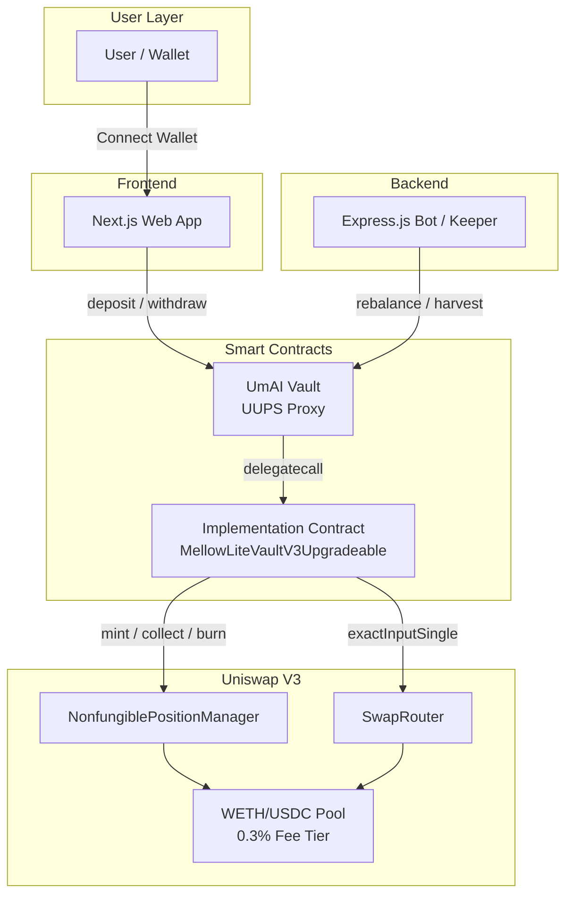
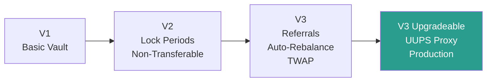
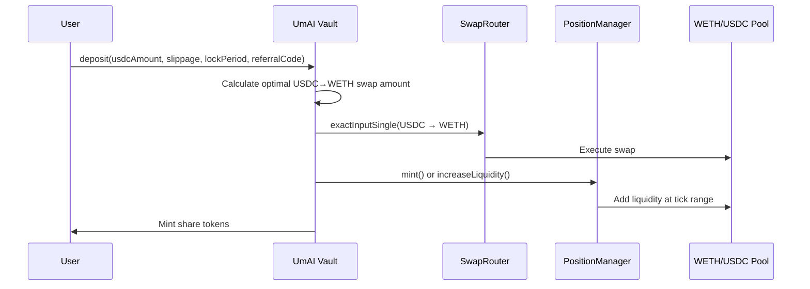
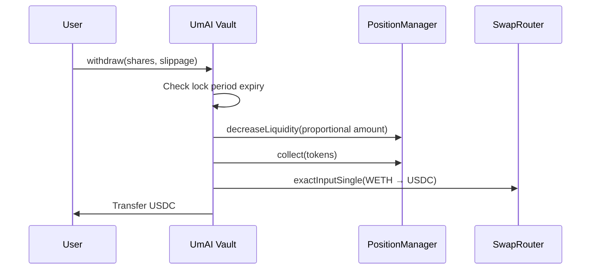
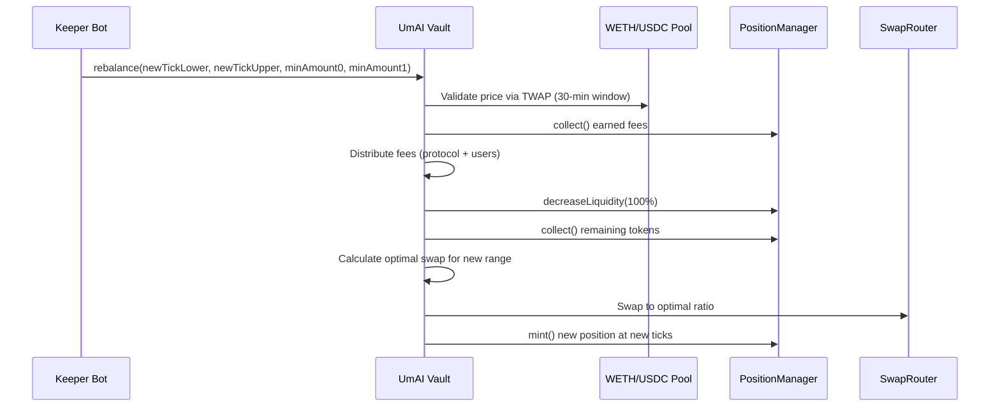

# Architecture Overview

This page describes the overall system architecture of UmAI, including all major components, the contract evolution history, data flows, and the upgradeability pattern.

---

## System Architecture

UmAI follows a layered architecture where the user interacts with a frontend, which communicates with smart contracts deployed on Base, which in turn interact with Uniswap V3 pool contracts.



### Component Breakdown

| Component | Technology | Role |
|---|---|---|
| **Web App** | Next.js (React) | User-facing interface for deposits, withdrawals, and position monitoring |
| **Keeper Bot** | Express.js | Automated off-chain service that triggers rebalances and harvests when conditions are met |
| **UmAI Vault (Proxy)** | Solidity, ERC1967 Proxy | Transparent entry point for all user and keeper interactions; stores all state |
| **Implementation Contract** | Solidity (UUPS) | Contains the vault logic; upgradeable without migrating state or changing the proxy address |
| **Uniswap V3 Contracts** | Uniswap Protocol | NonfungiblePositionManager for LP positions, SwapRouter for token swaps, Pool for pricing |

---

## Contract Evolution

The UmAI vault has gone through four major iterations, each adding critical functionality:



### V1 -- MellowLiteVault

The initial implementation. A simple vault that:

- Accepted USDC deposits and minted ERC20 share tokens
- Calculated optimal swaps for concentrated liquidity positions
- Allowed manager-triggered harvesting and rebalancing
- Distributed fees to a `feeRecipient` address

**Limitations:** Shares were transferable (lock bypass risk), no referral system, no automated rebalance triggers, no upgrade path.

### V2 -- MellowLiteVaultV2

Added economic safeguards:

- **Lock periods** with variable fee tiers (3/6/12 months)
- **Non-transferable shares** via overridden `_update` function -- transfers between non-zero addresses revert
- **Weighted fee calculation** across all depositors based on their individual lock period selections
- **Deadline-based slippage protection** on swaps

### V3 -- MellowLiteVaultV3

Added automation and growth features:

- **Referral system** with custom fee codes -- each referral code maps to a specific fee rate
- **Auto-rebalance** with on-chain `needsRebalance()` check
- **TWAP price oracle** validation (30-minute window, 2% max deviation) to prevent manipulation during rebalances
- **Cooldown period** between rebalances to prevent excessive repositioning
- **Push-based fee distribution** with fallback to pending rewards for failed transfers

### V3 Upgradeable -- MellowLiteVaultV3Upgradeable (Production)

The current production contract, deployed behind a UUPS proxy:

- All V3 features preserved
- **UUPS (Universal Upgradeable Proxy Standard)** pattern for safe, owner-authorized upgrades
- `_authorizeUpgrade(address)` restricted to `onlyOwner`
- `initialize()` function replaces the constructor for proxy-compatible deployment
- State is stored in the proxy, logic lives in the implementation -- upgrades swap the implementation without affecting user funds or state

---

## UUPS Proxy Pattern

UmAI uses the UUPS (EIP-1822) proxy pattern for upgradeability. This is the recommended pattern from OpenZeppelin for production contracts.

```
┌─────────────────────┐       ┌──────────────────────────────┐
│     ERC1967 Proxy    │       │   Implementation Contract     │
│                     │       │   (MellowLiteVaultV3          │
│  - Stores all state │──────►│    Upgradeable)               │
│  - Fixed address    │       │                                │
│  - delegatecall     │       │  - Contains all logic          │
│                     │       │  - _authorizeUpgrade(onlyOwner)│
└─────────────────────┘       └──────────────────────────────┘
```

**Key properties:**

- The proxy address never changes -- users always interact with the same contract address
- All storage (balances, positions, depositor data) lives in the proxy
- Only the owner can authorize an upgrade via `_authorizeUpgrade`
- The implementation contract includes an `initializer` modifier to prevent re-initialization attacks

```solidity
/// @notice Restricts upgrade authorization to the contract owner
function _authorizeUpgrade(address newImplementation) internal override onlyOwner {}
```

---

## Data Flows

### Deposit Flow



### Withdrawal Flow



### Rebalance Flow



---

## Network Configuration

| Parameter | Value |
|---|---|
| **Network** | Base Mainnet (Chain ID: 8453) |
| **Vault Proxy Address** | `0x331a49587A42b92fd0bC2B31cdB07BD0cfC7C8f5` |
| **Target Pool** | WETH/USDC 0.30% fee tier |
| **WETH (Base)** | `0x4200000000000000000000000000000000000006` |
| **USDC (Base)** | `0x833589fCD6eDb6E08f4c7C32D4f71b54bdA02913` |
| **Uniswap V3 Position Manager** | `0x03a520b32C04BF3bEEf7BEb72E919cf822Ed34f1` |
| **Uniswap V3 SwapRouter** | `0x2626664c2603336E57B271c5C0b26F421741e481` |

---

## Related Pages

- [Smart Contracts Overview](../smart-contracts/overview.md) -- Contract versions and interfaces
- [Vault Mechanics](../smart-contracts/vault-mechanics.md) -- Detailed deposit, withdraw, and rebalance logic
- [Security](../smart-contracts/security.md) -- TWAP, slippage, reentrancy, and access control
