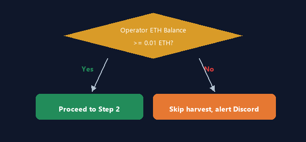
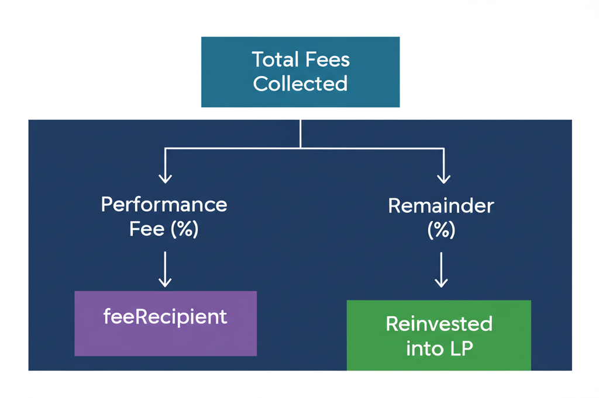

# Harvester

The Harvester module automatically collects accumulated trading fees from the vault's Uniswap V3 liquidity position, splits them according to the protocol's fee structure, and reinvests the remainder back into the position for compounding returns.

---

## What Harvesting Does

When the UmAI Vault provides concentrated liquidity on Uniswap V3, it earns trading fees proportional to its share of the active tick range. These fees accumulate in the position but are **not automatically claimed** by Uniswap. The Harvester performs this collection and allocation on a scheduled basis.

### The Harvest Cycle


---

## Default Schedule

The Harvester runs **once daily at midnight UTC** by default.

```
# Default cron expression
HARVEST_CRON="0 0 * * *"
```

### Custom Schedules

You can adjust the harvest frequency using standard cron syntax:

| Schedule | Cron Expression | Use Case |
|----------|----------------|----------|
| Midnight UTC (default) | `0 0 * * *` | Standard operation |
| Every 12 hours | `0 */12 * * *` | Higher fee volume |
| Every 6 hours | `0 */6 * * *` | Very active pools |
| Once per week (Sunday) | `0 0 * * 0` | Low fee volume |

> **Note:** Harvesting more frequently increases gas costs but compounds returns faster. For most pools, daily harvesting provides a good balance.

---

## Detailed Flow

### Step 1: Pre-flight Gas Check

Before initiating the harvest, the bot checks the operator wallet's ETH balance on Base.



If the balance is below the `GAS_THRESHOLD` (default: 0.01 ETH), the harvest is skipped entirely and a warning notification is sent to Discord.

### Step 2: Call `harvestAndAllocate()`

The bot sends a transaction to the UmAI Vault contract calling the `harvestAndAllocate()` function. This is a single on-chain call that:

1. **Collects** all accumulated WETH and USDC fees from the Uniswap V3 position via the NonfungiblePositionManager.
2. **Calculates** the performance fee based on the configured fee rate.
3. **Transfers** the performance fee portion to the `feeRecipient` address.
4. **Reinvests** the remaining fees back into the liquidity position (auto-compounding).

```solidity
// Simplified contract interface
function harvestAndAllocate() external onlyManager;
```

### Step 3: Distribute Fees

The fee split happens on-chain within the `harvestAndAllocate()` function:



### Step 4: Send Alert

After the transaction confirms (or fails), the bot sends a Discord notification with details.

---

## Fee Split: Auto-Compounding

The UmAI Vault implements **auto-compounding** by default. After the performance fee is deducted, the remaining collected fees are automatically added back to the Uniswap V3 position. This increases the vault's liquidity depth, which in turn earns more fees in subsequent periods.

### Example

Suppose the vault collects 0.1 ETH and 200 USDC in daily fees, with a 10% performance fee:

| Component | WETH | USDC |
|-----------|------|------|
| Total Collected | 0.1 | 200 |
| Performance Fee (10%) | 0.01 | 20 |
| Reinvested (90%) | 0.09 | 180 |

The 0.09 WETH and 180 USDC are added back to the liquidity position, increasing the vault's total value and future fee earnings.

---

## Error Handling and Retry Logic

If the harvest transaction fails, the bot retries with exponential backoff:

| Attempt | Action | Delay Before Next |
|---------|--------|-------------------|
| 1 | Initial attempt | -- |
| 2 | 1st retry | 2 seconds |
| 3 | 2nd retry | 4 seconds |
| 4 | 3rd retry | 8 seconds |

After all retries are exhausted, the failure is recorded by the circuit breaker. If the Harvester accumulates **5 consecutive failures**, the circuit breaker trips and the module is paused.

### Common Failure Reasons

| Error | Cause | Resolution |
|-------|-------|------------|
| Insufficient gas | Operator wallet ETH depleted | Top up the operator wallet on Base |
| Transaction reverted | No fees to collect, or contract paused | Check vault status; fees may already be harvested |
| RPC timeout | Network congestion or RPC provider issue | Retry will handle transient issues; check RPC provider if persistent |
| Nonce too low | Concurrent transaction conflict | Bot auto-recovers on next attempt |

---

## Discord Notifications

### Success Notification

When a harvest completes successfully, the bot sends a green-colored Discord embed:

```
[Harvest Success]
Collected: 0.1 WETH + 200 USDC
Performance Fee: 0.01 WETH + 20 USDC
Reinvested: 0.09 WETH + 180 USDC
Tx: https://basescan.org/tx/0x...
Gas Used: 0.002 ETH
```

### Failure Notification

When a harvest fails after all retries, the bot sends a red-colored Discord embed:

```
[Harvest Failed]
Error: Transaction reverted: no fees to collect
Attempts: 4 (1 initial + 3 retries)
Circuit Breaker: 2/5 failures
```

### Low Gas Warning

```
[Low Gas Warning]
Operator Balance: 0.005 ETH
Threshold: 0.01 ETH
Action: Harvest skipped — please top up the operator wallet
```

---

## Configuration

All Harvester settings are controlled via environment variables:

| Variable | Required | Default | Description |
|----------|----------|---------|-------------|
| `HARVEST_CRON` | No | `0 0 * * *` | Cron schedule for harvesting |
| `GAS_THRESHOLD` | No | `0.01` | Minimum ETH balance to proceed (in ETH) |
| `MAX_RETRIES` | No | `3` | Number of retry attempts |
| `RETRY_BASE_DELAY` | No | `2000` | Base delay between retries (ms) |
| `DISCORD_WEBHOOK_URL` | No | -- | Webhook URL for notifications |

### Example `.env` Configuration

```bash
# Harvest every 12 hours
HARVEST_CRON="0 */12 * * *"

# Require at least 0.02 ETH for gas
GAS_THRESHOLD=0.02

# Retry up to 5 times
MAX_RETRIES=5

# Discord alerts
DISCORD_WEBHOOK_URL="https://discord.com/api/webhooks/..."
```

---

## Manual Harvest

In addition to the automated cron schedule, operators can trigger a harvest manually by calling the bot's API:

```bash
curl -X POST http://localhost:3001/api/harvest \
  -H "X-API-KEY: your-api-key"
```

This is useful for testing, or for triggering an immediate harvest after a period of high trading volume.
