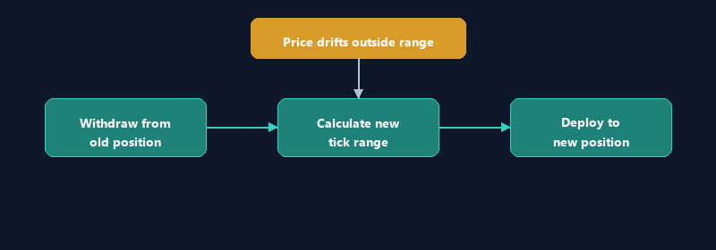

# Rebalancer

The Rebalancer module monitors the WETH/USDC pool price and automatically repositions the vault's concentrated liquidity when the current price drifts outside the active tick range. This ensures the vault continues earning trading fees even as the market moves.

***

## What Rebalancing Does

In Uniswap V3, concentrated liquidity positions only earn fees when the current pool price is **within** the position's tick range. When the price moves outside this range, the position becomes inactive and stops earning.

The Rebalancer detects this condition and executes the following:

1. **Withdraws** all liquidity from the current (out-of-range) position.
2. **Calculates** a new tick range centered around the current price.
3. **Deploys** liquidity into the new range.



***

## When It Triggers

The Rebalancer does **not** rebalance on a fixed schedule. Instead, it **checks** on a fixed interval and only triggers a rebalance when two conditions are both met:

1. **Position is out of range** -- the current pool tick is outside the vault's `[tickLower, tickUpper]` bounds.
2. **Cooldown has elapsed** -- at least 60 minutes have passed since the last rebalance.


***

## Check Interval

The Rebalancer checks the pool state every **5 minutes** by default. This interval is configurable:

```bash
# Default: check every 5 minutes
REBALANCE_CRON="*/5 * * * *"

# Check every minute (higher gas for reads, faster response)
REBALANCE_CRON="* * * * *"

# Check every 15 minutes (lower overhead, slower response)
REBALANCE_CRON="*/15 * * * *"
```

> **Note:** The check itself is a read-only RPC call (no gas cost). Only the actual rebalance transaction consumes gas.

***

## Cooldown Period

To prevent excessive rebalancing during volatile markets (which would incur gas costs and potential slippage), a **60-minute cooldown** is enforced between rebalance operations.

| Parameter            | Default | Description                        |
| -------------------- | ------- | ---------------------------------- |
| `REBALANCE_COOLDOWN` | `60`    | Minimum minutes between rebalances |

### Why a Cooldown?

During high volatility, the price may rapidly oscillate around the range boundaries. Without a cooldown, the bot could rebalance every 5 minutes, each time paying gas and potentially suffering slippage. The cooldown ensures the bot waits for the market to settle before repositioning.

***

## Range Width

When the Rebalancer creates a new position, it centers the tick range around the current pool tick with a configurable width.

| Parameter     | Default | Description          |
| ------------- | ------- | -------------------- |
| `RANGE_WIDTH` | `4000`  | Total width in ticks |

The default width of **4000 ticks** corresponds to approximately **plus or minus 5%** from the current price. This provides a balance between:

* **Narrow ranges** -- higher fee concentration but more frequent rebalancing needed
* **Wide ranges** -- less frequent rebalancing but lower capital efficiency

### Tick Range Calculation

```
currentTick = pool.slot0().tick

tickLower = currentTick - (RANGE_WIDTH / 2)
tickUpper = currentTick + (RANGE_WIDTH / 2)

# Adjusted to nearest valid tick spacing (60 for 0.3% fee tier)
tickLower = floor(tickLower / 60) * 60
tickUpper = ceil(tickUpper / 60) * 60
```

### Example

If the current WETH/USDC tick is `-202360` with a range width of 4000:

| Parameter            | Value   |
| -------------------- | ------- |
| Current Tick         | -202360 |
| Raw Lower            | -204360 |
| Raw Upper            | -200360 |
| Adjusted Lower (÷60) | -204360 |
| Adjusted Upper (÷60) | -200360 |

***

## Auto-Rebalance Toggle

By default, automatic rebalancing is **disabled**. This is a safety measure to prevent unintended rebalances during initial setup or unusual market conditions.

| Parameter        | Default | Description                  |
| ---------------- | ------- | ---------------------------- |
| `AUTO_REBALANCE` | `false` | Enable automatic rebalancing |

To enable auto-rebalance:

```bash
AUTO_REBALANCE=true
```

When `AUTO_REBALANCE` is `false`, the Rebalancer still checks the position status on schedule and sends Discord alerts when the position goes out of range, but it does **not** execute the rebalance transaction. An operator must trigger it manually.

***

## Breakout Confirmation Safety Check

Before executing a rebalance, the bot performs a **Breakout Confirmation** check to guard against price manipulation or flash loan attacks.

### How It Works

1. The bot reads the pool's time-weighted average price over a **30-minute window** using the Uniswap V3 oracle.
2. It compares the current spot price to the 30-minute time-weighted average.
3. If the deviation exceeds **2%**, the rebalance is skipped and a warning is sent to Discord.


### Configuration

| Parameter            | Default | Description                                    |
| -------------------- | ------- | ---------------------------------------------- |
| `TWAP_WINDOW`        | `1800`  | Breakout Confirmation observation window in seconds (30 min) |
| `TWAP_MAX_DEVIATION` | `200`   | Maximum allowed deviation in basis points (2%)               |

### Why This Matters

An attacker could temporarily move the pool price (via a flash loan or large swap) to trigger a rebalance at an unfavorable price. The Breakout Confirmation check ensures the bot only rebalances when the current price reflects genuine market conditions sustained over the observation window.

***

## Manual Rebalance from Manager Dashboard

Operators with the Manager role can trigger a rebalance manually through the UnAI frontend dashboard. This is useful when:

* Auto-rebalance is disabled but the position needs repositioning.
* The operator wants to set a custom tick range instead of the default centered range.
* Market conditions require immediate action outside the cooldown window.

### Via the Dashboard

1. Navigate to the **Manager** panel in the UnAI frontend.
2. Review the current position status (tick range, current tick, in/out of range).
3. Click **Rebalance** to trigger an immediate rebalance with default parameters.

### Via the Bot API

```bash
curl -X POST http://localhost:3001/api/rebalance \
  -H "X-API-KEY: your-api-key"
```

### Via the Smart Contract (Direct)

The vault's `rebalance()` function can be called directly by the Manager address:

```solidity
function rebalance(
    int24 newTickLower,
    int24 newTickUpper,
    uint256 minAmount0,
    uint256 minAmount1
) external onlyManager;
```

***

## Configuration Variables

Complete list of Rebalancer configuration:

| Variable              | Required | Default       | Description                          |
| --------------------- | -------- | ------------- | ------------------------------------ |
| `REBALANCE_CRON`      | No       | `*/5 * * * *` | How often to check position status   |
| `REBALANCE_COOLDOWN`  | No       | `60`          | Minimum minutes between rebalances   |
| `RANGE_WIDTH`         | No       | `4000`        | Tick range width for new positions   |
| `AUTO_REBALANCE`      | No       | `false`       | Enable automatic rebalance execution |
| `TWAP_WINDOW`         | No       | `1800`        | Breakout Confirmation observation window (seconds)    |
| `TWAP_MAX_DEVIATION`  | No       | `200`         | Max Breakout Confirmation deviation (basis points)    |
| `GAS_THRESHOLD`       | No       | `0.01`        | Min ETH balance to execute (in ETH)  |
| `DISCORD_WEBHOOK_URL` | No       | --            | Webhook URL for notifications        |

### Example `.env` Configuration

```bash
# Enable auto-rebalance
AUTO_REBALANCE=true

# Check every 3 minutes
REBALANCE_CRON="*/3 * * * *"

# 90-minute cooldown between rebalances
REBALANCE_COOLDOWN=90

# Wider range: ~±10%
RANGE_WIDTH=8000

# Stricter Breakout Confirmation: 1% max deviation
TWAP_MAX_DEVIATION=100

# 1-hour Breakout Confirmation window
TWAP_WINDOW=3600
```

***

## Discord Notifications

### Position Out of Range

```
[Position Out of Range]
Current Tick: -206400
Range: [-204360, -200360]
Auto-Rebalance: Disabled
Action: Manual rebalance required
```

### Rebalance Success

```
[Rebalance Success]
Old Range: [-204360, -200360]
New Range: [-208400, -204400]
Current Tick: -206400
Tx: https://basescan.org/tx/0x...
Gas Used: 0.005 ETH
```

### Rebalance Skipped (Breakout Confirmation)

```
[Rebalance Skipped — Breakout Confirmation Deviation]
Spot Price: $2,450.00
Avg Price (30min): $2,500.00
Deviation: 2.04% (threshold: 2.00%)
Action: Rebalance deferred until price stabilizes
```
