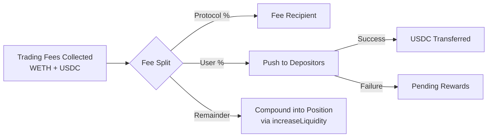

# Fee Structure

This page explains UmAI's fee system in detail: lock periods, fee calculation, distribution mechanics, referral codes, and fee compounding.

---

## Overview

UmAI charges a **performance fee** on earned trading fees -- not on deposited principal. The fee rate depends on two factors:

1. **Lock period** -- longer commitments earn lower fee rates
2. **Referral code** -- custom codes can override the default rate

The protocol never charges deposit fees, withdrawal fees, or management fees. Fees are only taken from Uniswap V3 trading fee income.

---

## Lock Periods

When depositing, users select one of three lock periods. Each lock period has a corresponding performance fee rate:

| Lock Period | Performance Fee | Unlock After |
|---|---|---|
| 3 months | 50% | 90 days from deposit |
| 6 months | 40% | 180 days from deposit |
| 12 months | 30% | 365 days from deposit |

### How Lock Periods Work

- The lock period begins at the timestamp of the `deposit()` transaction.
- During the lock period, the user **cannot withdraw** their funds. Any call to `withdraw()` will revert.
- After the lock expires (`block.timestamp >= lockExpiry`), the user can withdraw at any time.
- Lock periods are per-depositor. Each depositor has their own independent lock expiry.
- If a user makes additional deposits, the lock period behavior depends on the implementation version. In the current production contract, each deposit records its own lock parameters.

```solidity
// Lock period durations
uint256 constant LOCK_3_MONTHS  = 90 days;
uint256 constant LOCK_6_MONTHS  = 180 days;
uint256 constant LOCK_12_MONTHS = 365 days;

// Fee rates (basis points or percentage)
uint256 constant FEE_3_MONTHS  = 50; // 50%
uint256 constant FEE_6_MONTHS  = 40; // 40%
uint256 constant FEE_12_MONTHS = 30; // 30%
```

### Default Fee Rate

Users who deposit **without a referral code** and select no specific lock period receive the **default fee rate of 35%**. This rate is configurable by the contract owner.

---

## Fee Calculation

The vault uses a **weighted average fee rate** across all depositors when distributing earned trading fees.

### Weighted Average

Since different depositors may have different fee rates (based on their lock period or referral code), the vault calculates a single weighted average fee rate for each harvest:

```
weightedFeeRate = SUM(depositor_shares[i] * depositor_feeRate[i]) / totalShares
```

For example:

| Depositor | Shares | Fee Rate | Weight |
|---|---|---|---|
| Alice | 1,000 | 30% (12-month lock) | 300 |
| Bob | 500 | 50% (3-month lock) | 250 |
| Carol | 500 | 35% (referral code) | 175 |
| **Total** | **2,000** | | **725** |

```
Weighted fee rate = 725 / 2000 = 36.25%
```

If the vault earns 1,000 USDC in trading fees during this period:
- Protocol receives: 1,000 * 36.25% = 362.50 USDC
- Depositors receive: 1,000 - 362.50 = 637.50 USDC (distributed proportionally by shares)

### Per-Depositor Distribution

The user portion of fees is distributed proportionally based on share balance:

```
depositor_reward[i] = userFees * depositor_shares[i] / totalShares
```

Continuing the example above (637.50 USDC in user fees):

| Depositor | Shares | Share % | Reward |
|---|---|---|---|
| Alice | 1,000 | 50% | 318.75 USDC |
| Bob | 500 | 25% | 159.38 USDC |
| Carol | 500 | 25% | 159.37 USDC |

---

## Fee Distribution Mechanics

### Push-Based Distribution

When the vault harvests fees, it actively **pushes** rewards to depositors rather than requiring them to claim. This happens during the `harvest()` or `rebalance()` call:

```solidity
function _distributeFees(uint256 totalUserFees) internal {
    uint256 totalShares = totalSupply();

    for (uint256 i = 0; i < depositorList.length; i++) {
        address depositor = depositorList[i];
        uint256 shares = balanceOf(depositor);

        if (shares == 0) continue;

        uint256 reward = totalUserFees * shares / totalShares;

        // Attempt direct transfer
        (bool success, ) = address(usdc).call(
            abi.encodeWithSelector(
                IERC20.transfer.selector,
                depositor,
                reward
            )
        );

        if (!success) {
            // Fallback: store as pending reward
            pendingRewards[depositor] += reward;
            emit RewardPending(depositor, reward);
        } else {
            emit RewardDistributed(depositor, reward);
        }
    }
}
```

### Pending Rewards Fallback

If a direct transfer fails (for example, the depositor is a smart contract that reverts on receive, or gas is insufficient), the reward amount is stored in the `pendingRewards` mapping:

```solidity
mapping(address => uint256) public pendingRewards;
```

The depositor can later claim their pending rewards by calling:

```solidity
function claimPendingRewards() external nonReentrant {
    uint256 amount = pendingRewards[msg.sender];
    require(amount > 0, "No pending rewards");

    pendingRewards[msg.sender] = 0;
    IERC20(usdc).safeTransfer(msg.sender, amount);

    emit RewardsClaimed(msg.sender, amount);
}
```

### Fee Recipient

The protocol's share of fees is sent to the `feeRecipient` address, which is set by the contract owner:

```solidity
address public feeRecipient;

function setFeeRecipient(address _feeRecipient) external onlyOwner {
    require(_feeRecipient != address(0), "Zero address");
    feeRecipient = _feeRecipient;
}
```

The fee recipient can be changed at any time by the owner. This is typically a multisig or treasury address.

---

## Referral System

UmAI includes a referral code system that allows custom fee rates for users who deposit with a valid code.

### How Referral Codes Work

1. **Owner creates a referral code** with an associated fee rate:

```solidity
function setReferralCode(
    bytes32 code,
    uint256 feeRate
) external onlyOwner {
    require(feeRate <= 100, "Invalid fee rate");
    referralCodes[code] = ReferralCode({
        feeRate: feeRate,
        active: true
    });
    emit ReferralCodeCreated(code, feeRate);
}
```

2. **User provides the code at deposit time:**

```solidity
deposit(1000e6, 50, LOCK_6_MONTHS, keccak256("PARTNER_CODE"));
```

3. **The code's fee rate overrides the lock period's default rate.** For example, a referral code with 25% fee rate would give the user 25% fees regardless of their chosen lock period.

4. **One-time application.** The referral code is applied once when the user first deposits with it. Subsequent deposits by the same user retain the originally applied rate.

### Referral Code Properties

| Property | Description |
|---|---|
| `feeRate` | The custom performance fee percentage for users of this code |
| `active` | Whether the code is currently accepting new users |

### Example Scenario

The protocol partners with a DeFi aggregator and creates a referral code with a 25% fee rate (lower than the default 35% and even the 12-month lock's 30%):

```
Code: "DEFI_AGG_2025"
Fee rate: 25%
```

Users who deposit through the aggregator with this code pay only 25% performance fees, regardless of their lock period. The lock period still determines when they can withdraw, but not their fee rate.

---

## Fee Compounding

After distributing the protocol fee and user rewards, any remaining USDC and WETH in the vault are **compounded** back into the Uniswap V3 position:



Compounding increases the vault's total liquidity, which:

- Earns more trading fees per block
- Benefits all depositors proportionally
- Requires no action from users

This automatic compounding is one of UmAI's key advantages over manual LP management, where collected fees typically sit idle until the LP manually reinvests them.

---

## Fee Configuration Summary

| Parameter | Default Value | Configurable By |
|---|---|---|
| 3-month lock fee | 50% | Contract code (constant) |
| 6-month lock fee | 40% | Contract code (constant) |
| 12-month lock fee | 30% | Contract code (constant) |
| Default fee rate (no referral) | 35% | Owner (`setDefaultFeeRate`) |
| Referral code fee rate | Variable | Owner (`setReferralCode`) |
| Fee recipient address | Set at initialization | Owner (`setFeeRecipient`) |

---

## Related Pages

- [Vault Mechanics](vault-mechanics.md) -- Deposit, withdraw, and harvest flows
- [Smart Contracts Overview](overview.md) -- Contract versions and interfaces
- [Security](security.md) -- Access control and safety mechanisms
