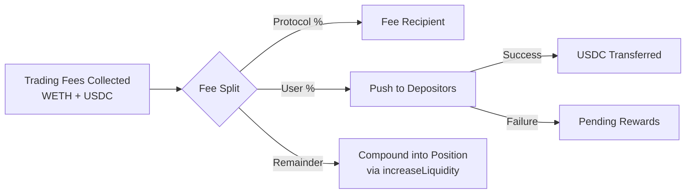

# Fee Structure

This page explains UnAI's fee system in detail: lock periods, fee calculation, distribution mechanics, referral codes, and fee compounding.

---

## Overview

UnAI charges a **performance fee** on earned trading fees -- not on deposited principal. The fee rate is uniform at 30% across all lock periods and depositors, with potential overrides via referral codes.

The protocol never charges deposit fees, withdrawal fees, or management fees. Fees are only taken from Uniswap V3 trading fee income.

---

## Lock Periods

When depositing, users select one of three lock periods. Each lock period has a corresponding performance fee rate:

| Lock Period | Performance Fee | Unlock After |
|---|---|---|
| 3 months | 30% | 90 days from deposit |
| 6 months | 30% | 180 days from deposit |
| 12 months | 30% | 365 days from deposit |

### How Lock Periods Work

- The lock period begins at the timestamp of the `deposit()` transaction.
- During the lock period, the user **cannot withdraw** their funds. Any call to `withdraw()` will revert.
- After the lock expires (`block.timestamp >= lockExpiry`), the user can withdraw at any time.
- Lock periods are per-depositor. Each depositor has their own independent lock expiry.
- If a user makes additional deposits, the lock period behavior depends on the implementation version. In the current production contract, each deposit records its own lock parameters.

```solidity
// Lock period durations
uint256 constant LOCK_3_MONTHS  = 90 days;
uint256 constant LOCK_6_MONTHS  = 180 days;
uint256 constant LOCK_12_MONTHS = 365 days;

// Fee rates (basis points or percentage)
uint256 constant FEE_3_MONTHS  = 30; // 30%
uint256 constant FEE_6_MONTHS  = 30; // 30%
uint256 constant FEE_12_MONTHS = 30; // 30%
```

### Uniform Fee Rate

All lock periods share the same **30% performance fee rate**. This rate is uniform across all depositors regardless of their chosen lock period.

---

## Fee Calculation

The vault uses a **weighted average fee rate** across all depositors when distributing earned trading fees.

### Weighted Average

Since different depositors may have different fee rates (based on their lock period or referral code), the vault calculates a single weighted average fee rate for each harvest:

```
weightedFeeRate = SUM(depositor_shares[i] * depositor_feeRate[i]) / totalShares
```

For example:

| Depositor | Shares | Fee Rate | Weight |
|---|---|---|---|
| Alice | 1,000 | 30% (12-month lock) | 300 |
| Bob | 500 | 30% (3-month lock) | 150 |
| Carol | 500 | 30% (referral code) | 150 |
| **Total** | **2,000** | | **600** |

```
Weighted fee rate = 600 / 2000 = 30%
```

If the vault earns 1,000 USDC in trading fees during this period:
- Protocol receives: 1,000 * 30% = 300 USDC
- Depositors receive: 1,000 - 300 = 700 USDC (distributed proportionally by shares)

### Per-Depositor Distribution

The user portion of fees is distributed proportionally based on share balance:

```
depositor_reward[i] = userFees * depositor_shares[i] / totalShares
```

Continuing the example above (700 USDC in user fees):

| Depositor | Shares | Share % | Reward |
|---|---|---|---|
| Alice | 1,000 | 50% | 350 USDC |
| Bob | 500 | 25% | 175 USDC |
| Carol | 500 | 25% | 175 USDC |

---

## Fee Distribution Mechanics

### Push-Based Distribution

When the vault harvests fees, it actively **pushes** rewards to depositors rather than requiring them to claim. This happens during the `harvest()` or `rebalance()` call:

```solidity
function _distributeFees(uint256 totalUserFees) internal {
    uint256 totalShares = totalSupply();

    for (uint256 i = 0; i < depositorList.length; i++) {
        address depositor = depositorList[i];
        uint256 shares = balanceOf(depositor);

        if (shares == 0) continue;

        uint256 reward = totalUserFees * shares / totalShares;

        // Attempt direct transfer
        (bool success, ) = address(usdc).call(
            abi.encodeWithSelector(
                IERC20.transfer.selector,
                depositor,
                reward
            )
        );

        if (!success) {
            // Fallback: store as pending reward
            pendingRewards[depositor] += reward;
            emit RewardPending(depositor, reward);
        } else {
            emit RewardDistributed(depositor, reward);
        }
    }
}
```

### Pending Rewards Fallback

If a direct transfer fails (for example, the depositor is a smart contract that reverts on receive, or gas is insufficient), the reward amount is stored in the `pendingRewards` mapping:

```solidity
mapping(address => uint256) public pendingRewards;
```

The depositor can later claim their pending rewards by calling:

```solidity
function claimPendingRewards() external nonReentrant {
    uint256 amount = pendingRewards[msg.sender];
    require(amount > 0, "No pending rewards");

    pendingRewards[msg.sender] = 0;
    IERC20(usdc).safeTransfer(msg.sender, amount);

    emit RewardsClaimed(msg.sender, amount);
}
```

### Fee Recipient

The protocol's share of fees is sent to the `feeRecipient` address, which is set by the contract owner:

```solidity
address public feeRecipient;

function setFeeRecipient(address _feeRecipient) external onlyOwner {
    require(_feeRecipient != address(0), "Zero address");
    feeRecipient = _feeRecipient;
}
```

The fee recipient can be changed at any time by the owner. This is typically a multisig or treasury address.

> **Note:** The `feeRecipient` is a dedicated address separate from the manager wallet. The owner sets this via `setFeeRecipient()`.

---

## Referral Affiliate System

UnAI includes an approval-based referral system that operates as an **affiliate model**. Referral code holders earn a commission from the protocol's fee share -- referred users pay the standard 30% performance fee with no additional cost.

### How It Works

1. **A user applies** for a referral code through the app (providing X ID and email). The platform admin reviews and approves the application, which auto-generates a referral code linked to the applicant's wallet.

2. **A referred user registers** with the referral code by visiting the app with `?utm_id=CODE` in the URL. The bot records the user-code association.

3. **At harvest time**, the bot's Distributor module calculates each referred user's proportional fee contribution and creates pending distribution records. The operator reviews and sends the code owner's commission from the protocol's 30% share.

### Commission Calculation

The commission is calculated per-harvest using a delta-based approach:

```
newFees = feeRecipientWethAfter - feeRecipientWethBefore
userProportion = userShares / totalSupply
estimatedUserFee = newFees * userProportion
ownerCommission = estimatedUserFee * codeSharePercent
```

### Distribution Schedule

- Harvests are recorded with a **24-hour delay** before distribution calculation (allows for reversal window).
- The Distributor processes pending harvests every hour (calculation only).
- Distribution records are created as **pending** -- the operator manually sends WETH and marks distributions as completed via the admin panel.

### Key Properties

| Property | Description |
|---|---|
| **Commission rate** | Configurable per code (e.g., 10%, 20%, 30%) |
| **Paid in** | WETH |
| **Source** | Protocol's 30% fee share (not from the user's 70%) |
| **Delay** | 24 hours after harvest (calculation), then manual operator review |
| **Distribution method** | Manual -- operator sends WETH and confirms via admin panel |

---

## Fee Compounding

After distributing the protocol fee and user rewards, any remaining USDC and WETH in the vault are **compounded** back into the Uniswap V3 position:



Compounding increases the vault's total liquidity, which:

- Earns more trading fees per block
- Benefits all depositors proportionally
- Requires no action from users

This automatic compounding is one of UnAI's key advantages over manual LP management, where collected fees typically sit idle until the LP manually reinvests them.

---

## Fee Configuration Summary

| Parameter | Default Value | Configurable By |
|---|---|---|
| 3-month lock fee | 30% | Contract code (constant) |
| 6-month lock fee | 30% | Contract code (constant) |
| 12-month lock fee | 30% | Contract code (constant) |
| Referral commission rate | Variable | Owner (per code) |
| Fee recipient address | Set at initialization | Owner (`setFeeRecipient`) |

---

## Related Pages

- [Vault Mechanics](vault-mechanics.md) -- Deposit, withdraw, and harvest flows
- [Smart Contracts Overview](overview.md) -- Contract versions and interfaces
- [Security](security.md) -- Access control and safety mechanisms
